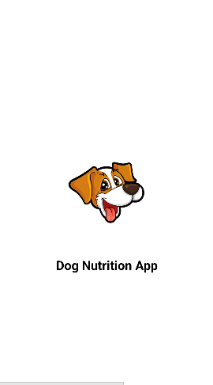
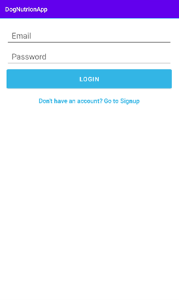
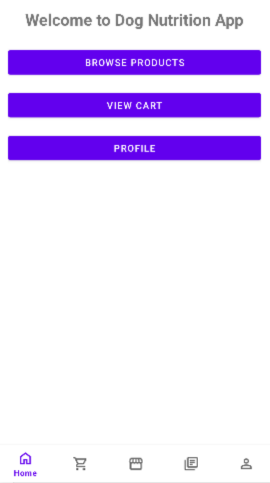
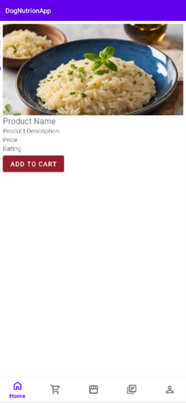
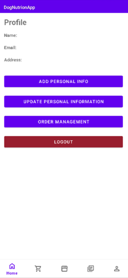
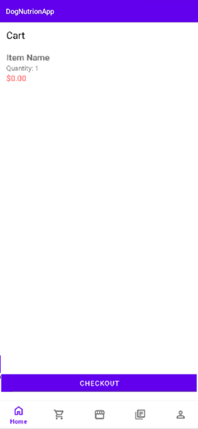
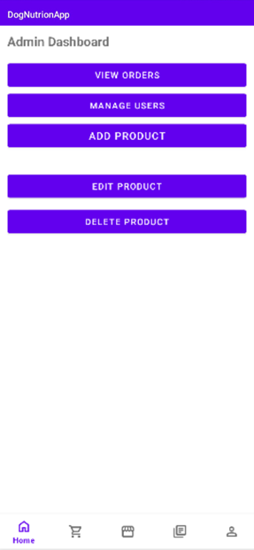

# Dog Nutrition App

## 🌟 Overview

The Dog Nutrition App empowers dog owners to make informed decisions about their pets' dietary needs, providing a convenient way to discover high-quality food, access valuable educational resources, and shop for their dog's nutritional needs.  This app simplifies the process of ensuring your furry friend receives the optimal diet for a healthy and happy life.


---

## ✨ Key Features

*   **Product Catalog:** Browse and search a comprehensive database of dog food products, filtering and sorting by brand, type, age, and other criteria. Detailed descriptions, pricing, and customer reviews help you make the best choice for your dog.
*   **Shopping Cart:** Add desired products to your cart, adjust quantities, view the subtotal, and proceed to checkout seamlessly.
*   **Educational Resources:** Access a library of articles, videos, and guides on dog nutrition, covering various topics such as breed-specific diets, life stage nutrition, and common dietary concerns.
*   **Admin Panel (For Admin Users):**  Manage all aspects of the product catalog (add, edit, delete products), oversee user accounts, and gain insights into user behavior and preferences.
*   **User Authentication:** Secure login and signup functionality allows users to create personalized profiles and securely manage their information.
*   **Profile Management:** Users can view and update their personal information, shipping address, and payment methods.


---

## 🛠️ Technology Stack

*   **Mobile:** Kotlin (Android), Android Studio
*   **Database:** SQLite
*   **Development Tools:**  Git, Android Studio
*   **Image Loading Library:** Glide

---

## 🚀 Getting Started

### Prerequisites

*   Android Studio (latest stable version recommended)
*   An Android emulator or physical device for testing
*   Git (for cloning the repository)

### Installation & Setup

1.  Clone the repository:
    ```bash
    git clone https://github.com/ama-23-ops/DogNutrition-UniversityProject.git 
    ```
2.  Open the project in Android Studio.
3.  Build and run the app on an emulator or physical device.


---

## 💡 Project Structure

DogNutrionApp/
├── app/
│ ├── src/
│ │ ├── main/
│ │ │ ├── java/com/example/dognutrionapp/
│ │ │ │ ├── ui/ # UI components (Activities, Fragments, Adapters, etc.)
│ │ │ │ ├── models/ # Data models (Product, User, etc.)
│ │ │ │ ├── database/ # Database helper class
│ │ │ │ └── networking/ # Networking code (if applicable)
│ │ ├── res/ # Resources (layouts, drawables, values, etc.)
│ │ └── AndroidManifest.xml
│ └── build.gradle
└── ...


---

## 🎯 Learning & Challenges

This project provided hands-on experience with native Android development in Kotlin, designing user interfaces with XML, and implementing local data persistence with SQLite. Understanding the Android activity lifecycle and managing UI state were important learning aspects.

---

## 📸 Screenshots

| Feature/Screen        | Screenshot                                                            |
| --------------------- | --------------------------------------------------------------------- |
| Splash Screen         |                         |
| Login Screen          |                          |
| Register Screen       |                       |
| Main Dashboard Screen |                 |
| Products Screen       |                       |
| Profile Screen        |                        |
| Cart Screen           |                           |
| Admin Panel Screen    |                    |

---

## 📜 License

This project is licensed under the MIT License - see the [LICENSE](LICENSE) file for details.

---
